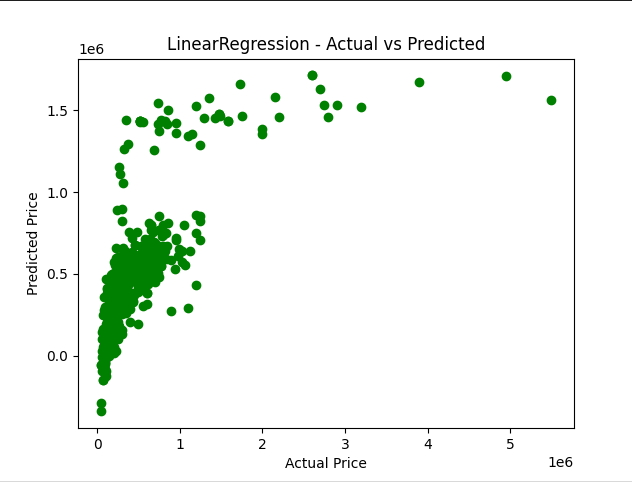
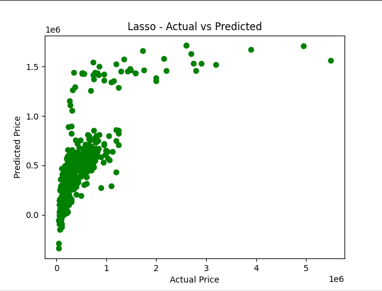

# 🚗 Car Price Prediction using Machine Learning

A machine learning project to predict the selling prices of used cars based on various features like brand, fuel type, transmission, and more. This project is built using Python and popular ML libraries like Scikit-learn and Pandas.

---

## 📌 Table of Contents

- [Project Overview](#project-overview)
- [Tech Stack](#tech-stack)
- [Data Source](#data-source)
- [Workflow](#workflow)
- [Results](#results)
- [Visualizations](#visualizations)
- [How to Run](#how-to-run)
- [Future Improvements](#future-improvements)
- [Author](#author)

---

## 📊 Project Overview

The goal of this project is to build a regression model that can accurately estimate the price of a used car based on attributes like:

- Year of manufacture
- Present price
- Kilometers driven
- Fuel type
- Seller type
- Transmission
- Number of previous owners

This can be helpful for car resellers, buyers, or marketplaces to estimate fair value.

---

## 🛠 Tech Stack

- Python 3
- Pandas
- NumPy
- Matplotlib
- Seaborn
- Scikit-learn

---

## 📂 Data Source

- Dataset: `CAR DETAILS FROM CAR DEKHO.csv`
- Source: [Kaggle Dataset](https://www.kaggle.com/datasets/)

---

## 🔄 Workflow

1. **Data Cleaning & Exploration**
   - Handled missing values
   - Explored distributions of categorical and numerical features

2. **Feature Engineering**
   - Label encoding for categorical features: `fuel`, `transmission`, `seller_type`, `owner`

3. **Model Building**
   - Split dataset using `train_test_split`
   - Applied:
     - Linear Regression
     - Lasso Regression

4. **Model Evaluation**
   - Measured accuracy using R² Score
   - Compared predictions with actual values using scatter plots

---

## 📈 Results

- **Linear Regression**
  - High performance with good R² score on both training and test data

- **Lasso Regression**
  - Simpler model with slightly lower accuracy but reduced overfitting

---

## 📷 Visualizations

- Actual vs Predicted prices for both Linear Regression and Lasso Regression test sets
- Data distributions for better understanding of features

<p align="center">
   
   
</p>

---

## ▶️ How to Run

1. Clone the repository:
   ```bash
   git clone https://github.com/AmritHimanshu/Car_Price_Prediction.git
   cd Car_Price_Prediction/server

2. Install dependencies:
    ```bash
    pip install -r requirements.txt

3. Run the script
    ```bash
    python index.py

